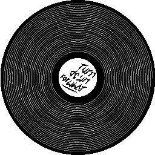

# Vixyl

## About

### Vixyl lets you read and create pixel art vinyls.

This project started thanks to a [tweet by Notch](https://twitter.com/notch/status/490927655806853120), which contained just this image:

Encoded in the spiral is an 8-bit mono 4kHz audio track, containing 3 seconds of the song "Turn Down for What". Vixyl implements the idea of encoding binary data into an image in a more generic way. That means you can use it to encode any file into a vinyl.

## Usage

### Reading a vinyl

1. Go to https://lucascorpion.github.io/vixyl/#/read
2. Load the vinyl image you want to read
3. Click the "Read" button

### Creating a vinyl

1. Go to https://lucascorpion.github.io/vixyl/#/create
2. Load the file you want to encode
3. Select an encoding method (e.g. Rainbow Spiral)
4. Set the encoder options (e.g. background color)
5. Click the "Create" button

## Development

1. Clone the repo
2. Run `npm install`
3. Run `npm start`, this will open a browser to http://localhost:3000/vixyl

Any changes in the code should automatically reload the tab.
